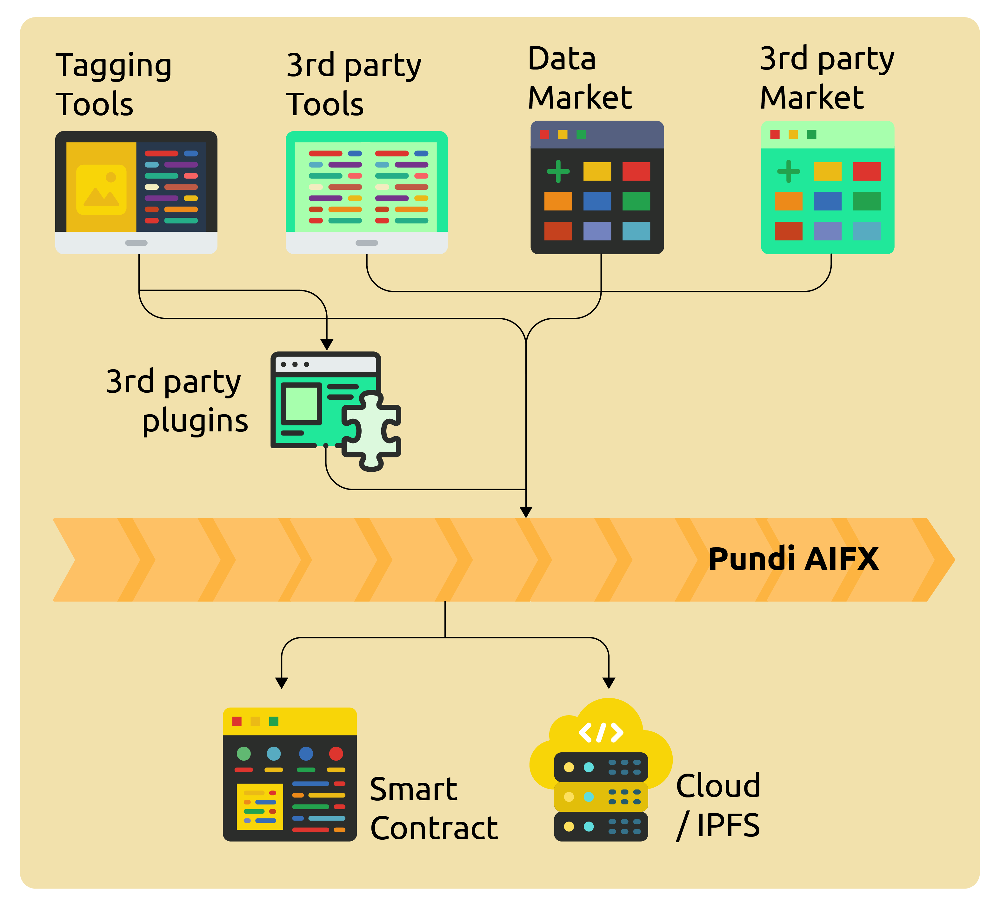

# Data Labelling

Pundi AIFX will provide comprehensive tools that facilitate the entire process from uploading source data to using AI-assisted tagging systems. These tools will be tailored to align with workflows of AI research and development teams, offering various data categorizations such as high-precision, small-scale pre-training data. They will also integrate with the RLHF (Reinforcement Learning from Human Feedback) process in AI model development, enabling data processors to provide high-quality, targeted services that meet the needs of model fine-tuning and other requirements from original data providers.

As a decentralized open system, any developer can create labeling systems or plugins tailored to Pundi AIFX users, matching different models and functionalities. Developers can also design tools specifically for workflows of different model teams and utilize Pundi AIFX's on-chain data to develop diverse data markets or filtering tools. All efforts aim to efficiently and effectively match data to developers, enhancing the overall ecosystem.

<figure><figcaption></figcaption></figure>
