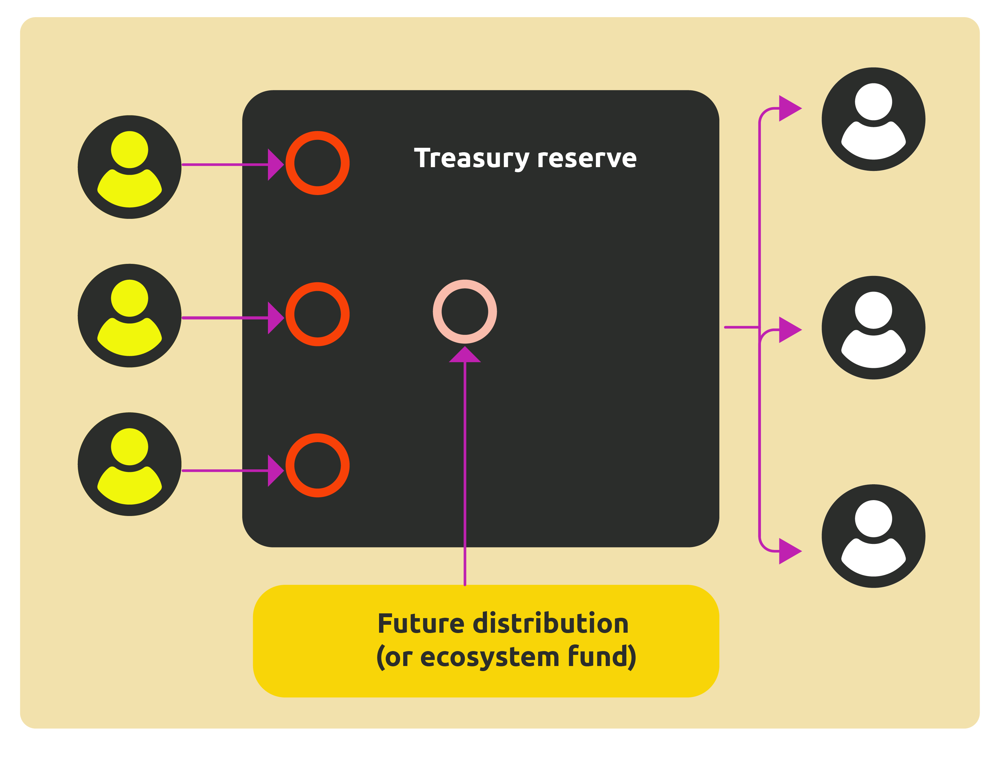

# Earnings Distribution Mechanism

After paying the token of Pundi AIFX, data users' funds enter the contract fund pool. Here, the contract marks each resource contributor's share of earnings based on the type and quantity of data purchased by the user. If additional manual services are required later, extra Pundi AIFX funds will be allocated to the pool for distribution.

The distribution system also includes an additional incentive mechanism where the contract automatically provides extra Pundi AIFX rewards for pending earnings. This benefit is shared among all content contributors, not just those whose data contributions were adopted. This ranges from an additional 1% to 5% based on the funds paid by the data user. This is aimed at encouraging contributors whose data was not adopted to receive token rewards quickly and to improve the quality of their data contributions and adjust the types of data needed in the market for future work.

<figure><figcaption></figcaption></figure>
