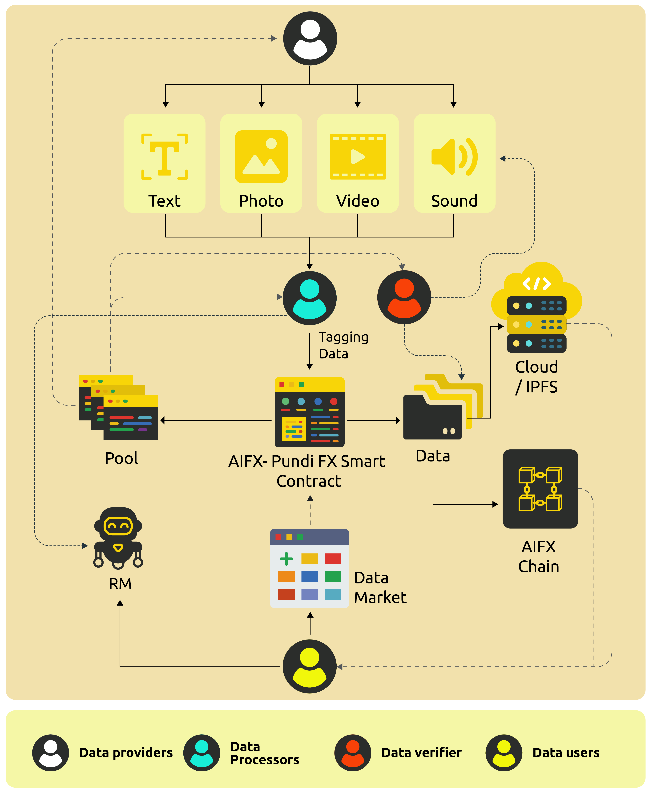

# PUNDI AIDATA

## Overview of the solution

We categorize contributors in our comprehensive solution as follows:

* Data providers (Content Contributors, data scraper) - represented in white
* Data processors (Data label, data tagging) - represented in blue

> PUNDI AIFX's mission is to democratize data contribution and production, delivering high-quality, diverse datasets for the next generation of AI and ensuring fair compensation for AI contributors.

* Data verifier (Quality Checkers) - represented in red
* Data users (Data buyers) - represented in yellow

Content contributors are divided into data sources and taggers. They use tools provided by us and community developers to upload or tag textual, image, video, and audio content. This content is sent to contracts for verification and recording in the form of NFTs, where the tag content is encrypted jointly by the uploader and the contract. The source data files are also uploaded to the cloud or IPFS via these tools.

Therefore, all content is easily indexed on the blockchain and corresponding contracts. We will launch a content marketplace that allows users to search and retrieve desired content efficiently by category, unlocking and downloading it after payment in Pundi AIFX.

Before downloading, data users need to pay Pundi AIFX, which enters the contract's compensation pool pending payment. The contract distributes funds to content contributors based on content quality and usage. The pool generates additional revenue to incentivize all content contributors.

The entire process ensures transparent tracking of data sources, enabling model developers to provide pre-training feedback or reward model fine-tuning. This can be directly facilitated by contributors of adopted content and tags.

> PUNDI AIFX's mission is to democratize data contribution and production, delivering high-quality, diverse datasets for the next generation of AI and ensuring fair compensation for AI contributors.

Pundi AIFX is building an open, transparent, and decentralized AI data platform. Through decentralized and fair incentive mechanisms, we aim to continuously improve the quality and quantity of AI data while ensuring that a higher proportion of the fees paid by data users go directly to data providers. This way, the decentralized and open nature of blockchain can drive the AI revolution.

<figure><figcaption></figcaption></figure>
