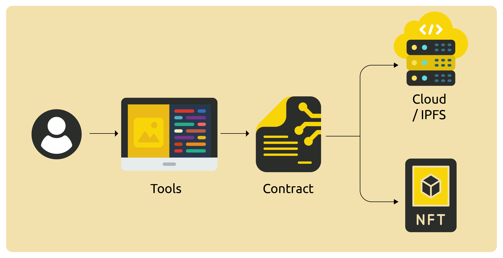

# Data Intellectual Property and Smart Contracts

Pundi AI Data aims to encourage over 10 million global participants to engage in tagging and collaborative work for AI data. One of our primary goals is to address the issue of intellectual property rights for production data. The blockchain ledger and NFTs provide an excellent solution by recording everyone's contributions on-chain and permanently preserving them in NFT form. Each time data is used by model developers, the smart contracts and NFTs on the blockchain ensure that contributors receive compensation for their efforts. This mechanism will significantly boost participation in AI training data tagging and related tasks, driving us towards our goal of rapidly growing to a user base of millions or even more.

Each data label's encryption is securely stored within the NFT information. Untagged source data remains stored in the cloud and IPFS. Only when a user initiates a transaction on the blockchain and the contract receives and pays a specified fee, will the data be signed and made accessible. Nodes then process the data, merge it, and provide the user with a download link and method, ensuring decentralized and fair operation of the entire system.

<figure><figcaption></figcaption></figure>
