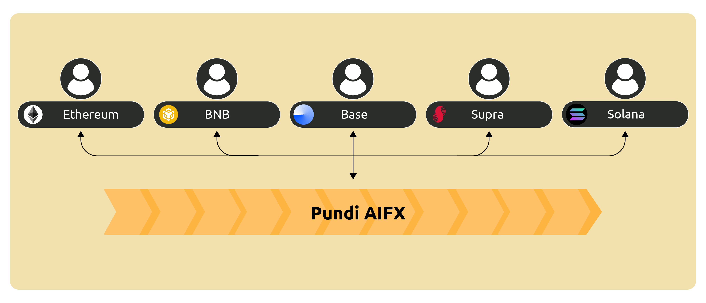
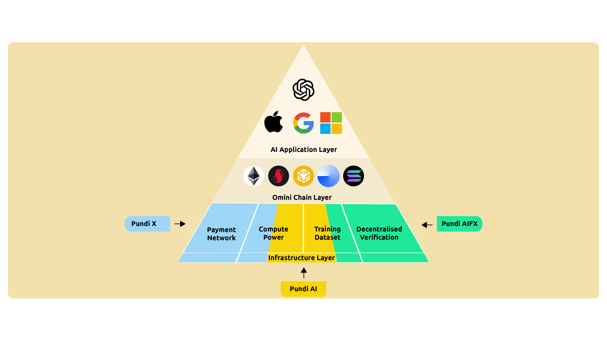

# Omnichain

The entire system architecture operates on the underlying Pundi AIFX chain and seamlessly connects to all major blockchain mainnets through Omnichain integration, including Ethereum, Base, BNB, Poly, and others.

Projects and users on these mainnets can access the full suite of Pundi AIFX systems without needing to engage in cross-chain operations. They can participate as content contributors by uploading and tagging content, or as content users browsing and downloading AI training data, all while remaining within their familiar mainnet environment. Developers can also engage in these activities and interact with the system through their preferred mainnet interfaces.

<figure><figcaption></figcaption></figure>

<figure><figcaption></figcaption></figure>
