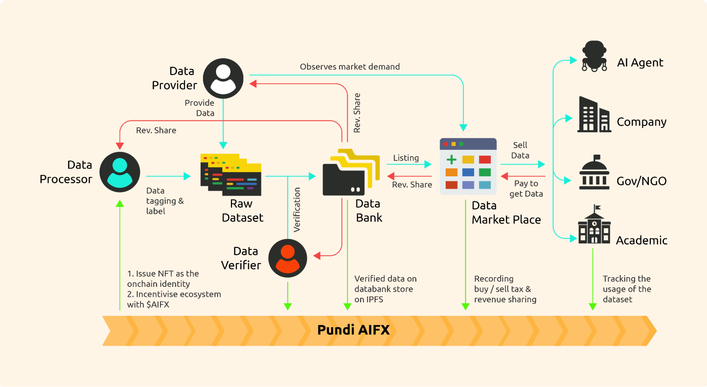

# The AI Flywheel: Components and Roles

## **Contributors**

1. Data Providers: Specialists who scrape and gather data from various sources, ensuring a steady influx of raw information.
2. Data Processors: Networks, guilds, or key opinion leaders (KOLs) who tag and label data, transforming it into usable formats.
3. Data Verifiers: Quality control professionals who ensure the accuracy and reliability of processed data

## **Marketplaces**

1. Data Marketplace: A platform where curated datasets are exchanged, facilitating the seamless transfer of high-quality data.
2. Compute Power Marketplace: A marketplace dedicated to decentralized compute power, allowing users to access and trade computational resources efficiently.

## **Buyers**

1. AI Agents: Autonomous entities that utilize data to perform specific tasks, driving the practical application of AI.
2. Model Trainers: Individuals or organizations that use datasets to train AI models, advancing&#x20;

<figure><figcaption></figcaption></figure>
