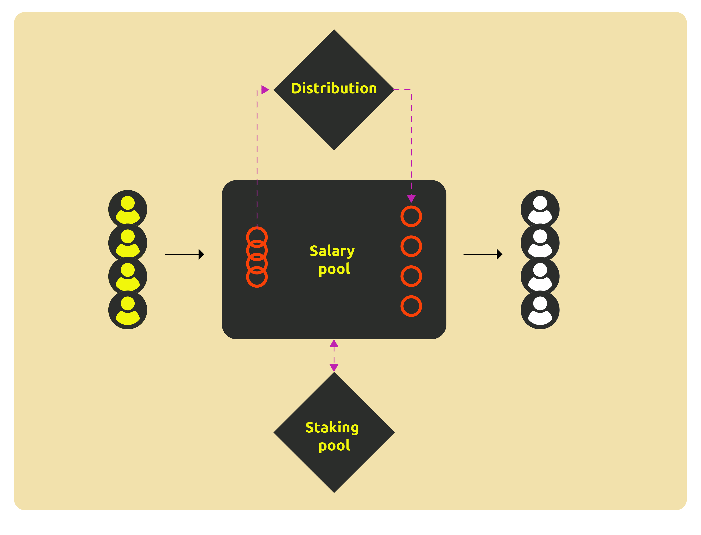

# Utilities of $AIFX

The $AIFX Token serves as a bridge between contributors and users of AI training verified data. Users acquire their required data and labels by purchasing them with Pundi AIFX Tokens. These payments are directed into the Pundi AI salary pool, managed by smart contracts that ensure fair and transparent distribution of labor compensation.

Periodically, rewards are distributed to the addresses of AI training verified data contributors based on a publicly disclosed allocation plan. As sales of data and usage of services increase, so does the contribution to AI training verified data, thereby increasing the total compensation that the system can distribute.

<figure><figcaption></figcaption></figure>

Simultaneously, the salary pool also serves as a staking yield pool. Before salary distribution, contributors automatically enjoy long-term inflation rewards from Pundi AI (if any), or other sources of income. This encourages AI training verified data contributors to delay withdrawals and enjoy long-term appreciation benefits.
