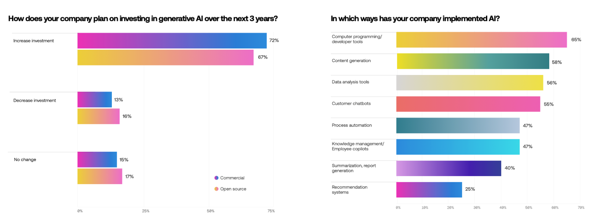

# Trend Research

* Critical Impact: Over 74% of organizations believe that artificial intelligence will have a crucial impact on their business in the next three years.
* Investment Plans: More than 72% of organizations plan to invest in AI models and related technologies within the next three years.
* Model Deployment: 22% of respondent organizations currently have only one model in production, while 27% have multiple models in production.

These trends highlight the growing recognition of AI's potential and the increasing commitment to integrating AI into business operations. The significant planned investments and the deployment of multiple models underscore the importance of AI in driving future business success.

<figure><figcaption></figcaption></figure>

<figure><figcaption></figcaption></figure>
